# DDD Class Diagram

> 생성일: 2026-01-27
> Phase 4 코드 생성의 기준 문서

---

## 주요 설계 원칙

1. **Supabase auth.users 기본 사용**: profiles 테이블로 추가 정보 연결 (FK)
2. **UUID v7 사용**: 시간순 정렬 가능한 ID (`uuid_generate_v7()`)
3. **PostGIS 사용**: 위치 데이터는 `GEOGRAPHY(Point, 4326)` 타입
4. **VARCHAR 길이 미지정**: 특수한 경우가 아니면 TEXT 또는 VARCHAR 사용 (길이 제한 없음)
5. **RPC/RLS 절대 금지**: 반드시 JWT 검증으로만 인증 처리
6. **이미지 업로드**: Supabase Storage Bucket + Presigned URL

---

## 1. 전체 Entity 관계도

```mermaid
erDiagram
    auth_users ||--|| Profile : "has"
    Profile ||--o{ Translation : "has"
    Profile ||--o{ MissionProgress : "has"
    Profile ||--o{ RouteHistory : "has"
    MissionTemplate ||--|{ MissionStep : "contains"
    MissionTemplate ||--o{ MissionProgress : "tracks"
    MissionStep ||--o{ MissionStepProgress : "tracks"
    MissionStep ||--o{ PhraseStepMapping : "linked_to"
    MissionProgress ||--|{ MissionStepProgress : "contains"
    Phrase ||--o{ PhraseStepMapping : "linked_to"

    auth_users {
        UUID id PK "Supabase 관리"
        String email "Supabase 관리"
    }

    Profile {
        UUID id PK "NOT NULL, uuid_generate_v7()"
        UUID user_id FK "NOT NULL -> auth.users.id, UNIQUE, CASCADE DELETE"
        String display_name "NULL"
        String preferred_language "NOT NULL, DEFAULT 'en'"
        String profile_image_url "NULL"
        DateTime created_at "NOT NULL, DEFAULT NOW()"
        DateTime updated_at "NOT NULL, DEFAULT NOW()"
    }

    Translation {
        UUID id PK "NOT NULL, uuid_generate_v7()"
        UUID profile_id FK "NOT NULL -> Profile.id, CASCADE DELETE"
        String source_text "NOT NULL"
        String translated_text "NOT NULL"
        String source_lang "NOT NULL"
        String target_lang "NOT NULL"
        TranslationType translation_type "NOT NULL"
        UUID mission_progress_id FK "NULL -> MissionProgress.id, SET NULL"
        String audio_url "NULL"
        Int duration_ms "NULL"
        Float confidence_score "NULL"
        DateTime created_at "NOT NULL, DEFAULT NOW()"
    }

    MissionTemplate {
        UUID id PK "NOT NULL, uuid_generate_v7()"
        String title_ko "NOT NULL"
        String title_en "NOT NULL"
        String description_ko "NOT NULL"
        String description_en "NOT NULL"
        MissionType mission_type "NOT NULL, UNIQUE"
        Int estimated_duration_min "NOT NULL"
        String icon_url "NULL"
        Boolean is_active "NOT NULL, DEFAULT true"
        DateTime created_at "NOT NULL, DEFAULT NOW()"
        DateTime updated_at "NOT NULL, DEFAULT NOW()"
    }

    MissionStep {
        UUID id PK "NOT NULL, uuid_generate_v7()"
        UUID mission_template_id FK "NOT NULL -> MissionTemplate.id, CASCADE DELETE"
        Int step_order "NOT NULL"
        String title_ko "NOT NULL"
        String title_en "NOT NULL"
        String description_ko "NOT NULL"
        String description_en "NOT NULL"
        DateTime created_at "NOT NULL, DEFAULT NOW()"
    }

    MissionProgress {
        UUID id PK "NOT NULL, uuid_generate_v7()"
        UUID profile_id FK "NOT NULL -> Profile.id, CASCADE DELETE"
        UUID mission_template_id FK "NOT NULL -> MissionTemplate.id, RESTRICT"
        MissionStatus status "NOT NULL, DEFAULT 'not_started'"
        MissionResult result "NULL"
        Int current_step "NOT NULL, DEFAULT 0"
        DateTime started_at "NULL"
        DateTime ended_at "NULL"
        DateTime created_at "NOT NULL, DEFAULT NOW()"
        DateTime updated_at "NOT NULL, DEFAULT NOW()"
    }

    MissionStepProgress {
        UUID id PK "NOT NULL, uuid_generate_v7()"
        UUID mission_progress_id FK "NOT NULL -> MissionProgress.id, CASCADE DELETE"
        UUID mission_step_id FK "NOT NULL -> MissionStep.id, RESTRICT"
        Boolean is_completed "NOT NULL, DEFAULT false"
        DateTime completed_at "NULL"
        DateTime created_at "NOT NULL, DEFAULT NOW()"
    }

    Phrase {
        UUID id PK "NOT NULL, uuid_generate_v7()"
        String text_ko "NOT NULL"
        String text_en "NOT NULL"
        PhraseCategory category "NOT NULL"
        Int usage_count "NOT NULL, DEFAULT 0"
        Boolean is_active "NOT NULL, DEFAULT true"
        DateTime created_at "NOT NULL, DEFAULT NOW()"
        DateTime updated_at "NOT NULL, DEFAULT NOW()"
    }

    PhraseStepMapping {
        UUID id PK "NOT NULL, uuid_generate_v7()"
        UUID phrase_id FK "NOT NULL -> Phrase.id, CASCADE DELETE"
        UUID mission_step_id FK "NOT NULL -> MissionStep.id, CASCADE DELETE"
        Int display_order "NOT NULL, DEFAULT 0"
        DateTime created_at "NOT NULL, DEFAULT NOW()"
    }

    RouteHistory {
        UUID id PK "NOT NULL, uuid_generate_v7()"
        UUID profile_id FK "NOT NULL -> Profile.id, CASCADE DELETE"
        String start_name "NOT NULL"
        Geography start_point "NOT NULL, GEOGRAPHY(Point, 4326)"
        String end_name "NOT NULL"
        Geography end_point "NOT NULL, GEOGRAPHY(Point, 4326)"
        JSON waypoints "NULL"
        RouteOption route_option "NOT NULL, DEFAULT 'traoptimal'"
        Int total_distance_m "NOT NULL"
        Int total_duration_s "NOT NULL"
        JSON path_data "NOT NULL"
        DateTime created_at "NOT NULL, DEFAULT NOW()"
    }
```



---

## 2. Entity 상세 명세

### 2.1 Profile (Supabase auth.users 확장)

> **주의**: auth.users는 Supabase가 관리하므로 직접 수정 불가. profiles 테이블로 추가 정보만 관리.

| Field | Type | PK | FK | NOT NULL | UNIQUE | DEFAULT | INDEX |
|-------|------|:--:|:--:|:--------:|:------:|---------|:-----:|
| id | UUID | O | | O | O | uuid_generate_v7() | |
| user_id | UUID | | O auth.users.id | O | O | | O |
| display_name | TEXT | | | | | | |
| preferred_language | VARCHAR(2) | | | O | | 'en' | |
| profile_image_url | TEXT | | | | | | |
| created_at | TIMESTAMPTZ | | | O | | NOW() | |
| updated_at | TIMESTAMPTZ | | | O | | NOW() | |

### 2.2 Translation

| Field | Type | PK | FK | NOT NULL | UNIQUE | DEFAULT | INDEX |
|-------|------|:--:|:--:|:--------:|:------:|---------|:-----:|
| id | UUID | O | | O | O | uuid_generate_v7() | |
| profile_id | UUID | | O Profile.id | O | | | O |
| source_text | TEXT | | | O | | | |
| translated_text | TEXT | | | O | | | |
| source_lang | VARCHAR(5) | | | O | | | |
| target_lang | VARCHAR(5) | | | O | | | |
| translation_type | TEXT | | | O | | | O |
| mission_progress_id | UUID | | O MissionProgress.id | | | | |
| audio_url | TEXT | | | | | | |
| duration_ms | INT | | | | | | |
| confidence_score | FLOAT | | | | | | |
| created_at | TIMESTAMPTZ | | | O | | NOW() | O |

### 2.3 MissionTemplate

| Field | Type | PK | FK | NOT NULL | UNIQUE | DEFAULT | INDEX |
|-------|------|:--:|:--:|:--------:|:------:|---------|:-----:|
| id | UUID | O | | O | O | uuid_generate_v7() | |
| title_ko | TEXT | | | O | | | |
| title_en | TEXT | | | O | | | |
| description_ko | TEXT | | | O | | | |
| description_en | TEXT | | | O | | | |
| mission_type | TEXT | | | O | O | | O |
| estimated_duration_min | INT | | | O | | | |
| icon_url | TEXT | | | | | | |
| is_active | BOOLEAN | | | O | | true | O |
| created_at | TIMESTAMPTZ | | | O | | NOW() | |
| updated_at | TIMESTAMPTZ | | | O | | NOW() | |

### 2.4 MissionStep

| Field | Type | PK | FK | NOT NULL | UNIQUE | DEFAULT | INDEX |
|-------|------|:--:|:--:|:--------:|:------:|---------|:-----:|
| id | UUID | O | | O | O | uuid_generate_v7() | |
| mission_template_id | UUID | | O MissionTemplate.id | O | | | O |
| step_order | INT | | | O | | | |
| title_ko | TEXT | | | O | | | |
| title_en | TEXT | | | O | | | |
| description_ko | TEXT | | | O | | | |
| description_en | TEXT | | | O | | | |
| created_at | TIMESTAMPTZ | | | O | | NOW() | |

**UNIQUE 복합 제약:** (mission_template_id, step_order)

### 2.5 MissionProgress

| Field | Type | PK | FK | NOT NULL | UNIQUE | DEFAULT | INDEX |
|-------|------|:--:|:--:|:--------:|:------:|---------|:-----:|
| id | UUID | O | | O | O | uuid_generate_v7() | |
| profile_id | UUID | | O Profile.id | O | | | O |
| mission_template_id | UUID | | O MissionTemplate.id | O | | | O |
| status | TEXT | | | O | | 'not_started' | O |
| result | TEXT | | | | | | |
| current_step | INT | | | O | | 0 | |
| started_at | TIMESTAMPTZ | | | | | | |
| ended_at | TIMESTAMPTZ | | | | | | |
| created_at | TIMESTAMPTZ | | | O | | NOW() | O |
| updated_at | TIMESTAMPTZ | | | O | | NOW() | |

### 2.6 MissionStepProgress

| Field | Type | PK | FK | NOT NULL | UNIQUE | DEFAULT | INDEX |
|-------|------|:--:|:--:|:--------:|:------:|---------|:-----:|
| id | UUID | O | | O | O | uuid_generate_v7() | |
| mission_progress_id | UUID | | O MissionProgress.id | O | | | O |
| mission_step_id | UUID | | O MissionStep.id | O | | | O |
| is_completed | BOOLEAN | | | O | | false | |
| completed_at | TIMESTAMPTZ | | | | | | |
| created_at | TIMESTAMPTZ | | | O | | NOW() | |

**UNIQUE 복합 제약:** (mission_progress_id, mission_step_id)

### 2.7 Phrase

| Field | Type | PK | FK | NOT NULL | UNIQUE | DEFAULT | INDEX |
|-------|------|:--:|:--:|:--------:|:------:|---------|:-----:|
| id | UUID | O | | O | O | uuid_generate_v7() | |
| text_ko | TEXT | | | O | | | |
| text_en | TEXT | | | O | | | |
| category | TEXT | | | O | | | O |
| usage_count | INT | | | O | | 0 | O |
| is_active | BOOLEAN | | | O | | true | O |
| created_at | TIMESTAMPTZ | | | O | | NOW() | |
| updated_at | TIMESTAMPTZ | | | O | | NOW() | |

### 2.8 PhraseStepMapping

| Field | Type | PK | FK | NOT NULL | UNIQUE | DEFAULT | INDEX |
|-------|------|:--:|:--:|:--------:|:------:|---------|:-----:|
| id | UUID | O | | O | O | uuid_generate_v7() | |
| phrase_id | UUID | | O Phrase.id | O | | | O |
| mission_step_id | UUID | | O MissionStep.id | O | | | O |
| display_order | INT | | | O | | 0 | |
| created_at | TIMESTAMPTZ | | | O | | NOW() | |

**UNIQUE 복합 제약:** (phrase_id, mission_step_id)

### 2.9 RouteHistory

| Field | Type | PK | FK | NOT NULL | UNIQUE | DEFAULT | INDEX |
|-------|------|:--:|:--:|:--------:|:------:|---------|:-----:|
| id | UUID | O | | O | O | uuid_generate_v7() | |
| profile_id | UUID | | O Profile.id | O | | | O |
| start_name | TEXT | | | O | | | |
| start_point | GEOGRAPHY(Point, 4326) | | | O | | | GIST |
| end_name | TEXT | | | O | | | |
| end_point | GEOGRAPHY(Point, 4326) | | | O | | | GIST |
| waypoints | JSONB | | | | | | |
| route_option | TEXT | | | O | | 'traoptimal' | |
| total_distance_m | INT | | | O | | | |
| total_duration_s | INT | | | O | | | |
| path_data | JSONB | | | O | | | |
| created_at | TIMESTAMPTZ | | | O | | NOW() | O |

---

## 3. Enum 정의

```python
from enum import Enum


class TranslationType(str, Enum):
    """번역 유형"""
    TEXT = "text"     # 텍스트 번역
    VOICE = "voice"   # 음성 번역 (STT + 번역 + TTS)


class MissionType(str, Enum):
    """미션 종류"""
    TAXI = "taxi"           # 택시 이용
    PAYMENT = "payment"     # 결제
    CHECKIN = "checkin"     # 체크인


class MissionStatus(str, Enum):
    """미션 진행 상태"""
    NOT_STARTED = "not_started"   # 시작 전
    IN_PROGRESS = "in_progress"   # 진행 중
    ENDED = "ended"               # 종료됨


class MissionResult(str, Enum):
    """미션 결과 (종료 시 선택)"""
    RESOLVED = "resolved"           # 해결됨
    PARTIALLY_RESOLVED = "partially_resolved"  # 부분 해결
    UNRESOLVED = "unresolved"       # 미해결


class PhraseCategory(str, Enum):
    """추천 문장 카테고리"""
    GREETING = "greeting"       # 인사
    REQUEST = "request"         # 요청
    CONFIRMATION = "confirmation"  # 확인
    THANKS = "thanks"           # 감사
    APOLOGY = "apology"         # 사과
    EMERGENCY = "emergency"     # 긴급 상황


class PreferredLanguage(str, Enum):
    """사용자 선호 언어"""
    KO = "ko"   # 한국어
    EN = "en"   # 영어


class RouteOption(str, Enum):
    """경로 옵션"""
    TRAOPTIMAL = "traoptimal"   # 실시간 최적
    TRAFAST = "trafast"         # 실시간 빠른길
    TRACOMFORT = "tracomfort"   # 실시간 편한길
    TRAAVOIDTOLL = "traavoidtoll"   # 무료 우선
    TRAAVOIDCARONLY = "traavoidcaronly"  # 자동차 전용도로 회피
```

---

## 4. 관계 매핑 상세

| Parent | Child | 관계 | FK Column | ON DELETE | ON UPDATE | Fetch | Orphan Removal |
|--------|-------|:----:|-----------|:---------:|:---------:|:-----:|:--------------:|
| auth.users | Profile | 1:1 | profile.user_id | CASCADE | CASCADE | EAGER | O |
| Profile | Translation | 1:N | translation.profile_id | CASCADE | CASCADE | LAZY | O |
| Profile | MissionProgress | 1:N | mission_progress.profile_id | CASCADE | CASCADE | LAZY | O |
| Profile | RouteHistory | 1:N | route_history.profile_id | CASCADE | CASCADE | LAZY | O |
| MissionTemplate | MissionStep | 1:N | mission_step.mission_template_id | CASCADE | CASCADE | EAGER | O |
| MissionTemplate | MissionProgress | 1:N | mission_progress.mission_template_id | RESTRICT | CASCADE | LAZY | |
| MissionStep | MissionStepProgress | 1:N | mission_step_progress.mission_step_id | RESTRICT | CASCADE | LAZY | |
| MissionStep | PhraseStepMapping | 1:N | phrase_step_mapping.mission_step_id | CASCADE | CASCADE | LAZY | O |
| MissionProgress | MissionStepProgress | 1:N | mission_step_progress.mission_progress_id | CASCADE | CASCADE | EAGER | O |
| MissionProgress | Translation | 1:N | translation.mission_progress_id | SET NULL | CASCADE | LAZY | |
| Phrase | PhraseStepMapping | 1:N | phrase_step_mapping.phrase_id | CASCADE | CASCADE | LAZY | O |

---

## 5. Cascade 삭제 규칙

```
auth.users 삭제 시 (Supabase 처리):
  +-- Profile --> CASCADE DELETE
        +-- Translation --> CASCADE DELETE
        +-- MissionProgress --> CASCADE DELETE
        |     +-- MissionStepProgress --> CASCADE DELETE
        +-- RouteHistory --> CASCADE DELETE

MissionTemplate 삭제 시:
  +-- MissionStep --> CASCADE DELETE
  |     +-- PhraseStepMapping --> CASCADE DELETE
  +-- MissionProgress --> RESTRICT (진행 중인 미션 있으면 삭제 불가)

MissionStep 삭제 시:
  +-- PhraseStepMapping --> CASCADE DELETE
  +-- MissionStepProgress --> RESTRICT (진행 기록 있으면 삭제 불가)

MissionProgress 삭제 시:
  +-- MissionStepProgress --> CASCADE DELETE
  +-- Translation.mission_progress_id --> SET NULL (연결만 해제)

Phrase 삭제 시:
  +-- PhraseStepMapping --> CASCADE DELETE
```

---

## 6. Index 전략

```sql
-- UUID v7 생성 함수 (필수)
CREATE EXTENSION IF NOT EXISTS "uuid-ossp";
CREATE EXTENSION IF NOT EXISTS "postgis";

-- UUID v7 함수 (시간순 정렬 가능)
CREATE OR REPLACE FUNCTION uuid_generate_v7()
RETURNS uuid AS $$
DECLARE
    unix_ts_ms bytea;
    uuid_bytes bytea;
BEGIN
    unix_ts_ms = substring(int8send(floor(extract(epoch FROM clock_timestamp()) * 1000)::bigint) FROM 3);
    uuid_bytes = unix_ts_ms || gen_random_bytes(10);
    uuid_bytes = set_byte(uuid_bytes, 6, (get_byte(uuid_bytes, 6) & 15) | 112);
    uuid_bytes = set_byte(uuid_bytes, 8, (get_byte(uuid_bytes, 8) & 63) | 128);
    RETURN encode(uuid_bytes, 'hex')::uuid;
END;
$$ LANGUAGE plpgsql;

-- profiles
CREATE UNIQUE INDEX idx_profile_user_id ON profiles(user_id);

-- translations
CREATE INDEX idx_translation_profile_id ON translations(profile_id);
CREATE INDEX idx_translation_type ON translations(translation_type);
CREATE INDEX idx_translation_created_at ON translations(created_at DESC);
CREATE INDEX idx_translation_profile_created ON translations(profile_id, created_at DESC);

-- mission_templates
CREATE UNIQUE INDEX idx_mission_template_type ON mission_templates(mission_type);
CREATE INDEX idx_mission_template_active ON mission_templates(is_active);

-- mission_steps
CREATE INDEX idx_mission_step_template_id ON mission_steps(mission_template_id);
CREATE UNIQUE INDEX idx_mission_step_order ON mission_steps(mission_template_id, step_order);

-- mission_progress
CREATE INDEX idx_mission_progress_profile_id ON mission_progress(profile_id);
CREATE INDEX idx_mission_progress_template_id ON mission_progress(mission_template_id);
CREATE INDEX idx_mission_progress_status ON mission_progress(status);
CREATE INDEX idx_mission_progress_profile_status ON mission_progress(profile_id, status);
CREATE INDEX idx_mission_progress_created_at ON mission_progress(created_at DESC);

-- mission_step_progress
CREATE INDEX idx_mission_step_progress_progress_id ON mission_step_progress(mission_progress_id);
CREATE INDEX idx_mission_step_progress_step_id ON mission_step_progress(mission_step_id);
CREATE UNIQUE INDEX idx_mission_step_progress_unique ON mission_step_progress(mission_progress_id, mission_step_id);

-- phrases
CREATE INDEX idx_phrase_category ON phrases(category);
CREATE INDEX idx_phrase_usage_count ON phrases(usage_count DESC);
CREATE INDEX idx_phrase_active ON phrases(is_active);

-- phrase_step_mapping
CREATE INDEX idx_phrase_step_mapping_phrase_id ON phrase_step_mapping(phrase_id);
CREATE INDEX idx_phrase_step_mapping_step_id ON phrase_step_mapping(mission_step_id);
CREATE UNIQUE INDEX idx_phrase_step_mapping_unique ON phrase_step_mapping(phrase_id, mission_step_id);

-- route_history (PostGIS)
CREATE INDEX idx_route_history_profile_id ON route_history(profile_id);
CREATE INDEX idx_route_history_created_at ON route_history(created_at DESC);
CREATE INDEX idx_route_history_profile_created ON route_history(profile_id, created_at DESC);
CREATE INDEX idx_route_history_start_point ON route_history USING GIST(start_point);
CREATE INDEX idx_route_history_end_point ON route_history USING GIST(end_point);
```

---

## 7. PostGIS 좌표 변환 (네이버 지도 호환)

네이버 지도 API는 WGS84 (EPSG:4326) 좌표계를 사용합니다.

```sql
-- 좌표 저장 예시
INSERT INTO route_history (start_point, end_point, ...)
VALUES (
    ST_SetSRID(ST_MakePoint(126.9706, 37.5547), 4326)::geography,  -- lng, lat 순서
    ST_SetSRID(ST_MakePoint(127.0276, 37.4979), 4326)::geography,
    ...
);

-- 좌표 조회 (lat, lng 추출)
SELECT
    ST_Y(start_point::geometry) as start_lat,
    ST_X(start_point::geometry) as start_lng,
    ST_Y(end_point::geometry) as end_lat,
    ST_X(end_point::geometry) as end_lng
FROM route_history;
```

---

## 8. 검증 체크리스트

- [x] auth.users 기본 사용 + profiles 확장 테이블
- [x] UUID v7 사용 (uuid_generate_v7())
- [x] PostGIS GEOGRAPHY 타입 사용
- [x] VARCHAR 길이 미지정 (TEXT 사용)
- [x] RPC/RLS 사용 안함 (JWT 검증만)
- [x] 모든 Entity 포함됨 (9개)
- [x] PK/FK 명시됨
- [x] NOT NULL 표시됨
- [x] UNIQUE 제약 표시됨
- [x] DEFAULT 값 정의됨
- [x] Enum 값 정의됨 (7개)
- [x] Cascade 규칙 명확함
- [x] Orphan Removal 대상 표시됨
- [x] Index 전략 정의됨 (PostGIS GIST 포함)
